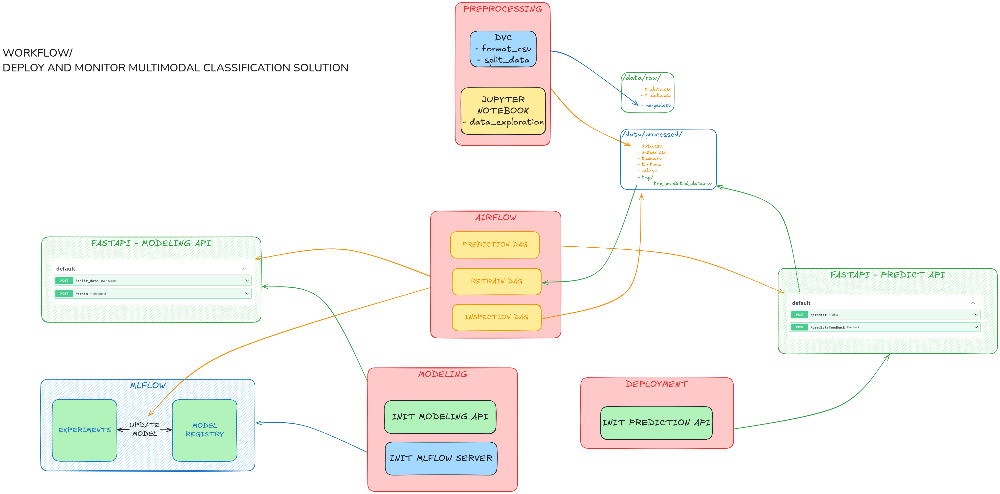
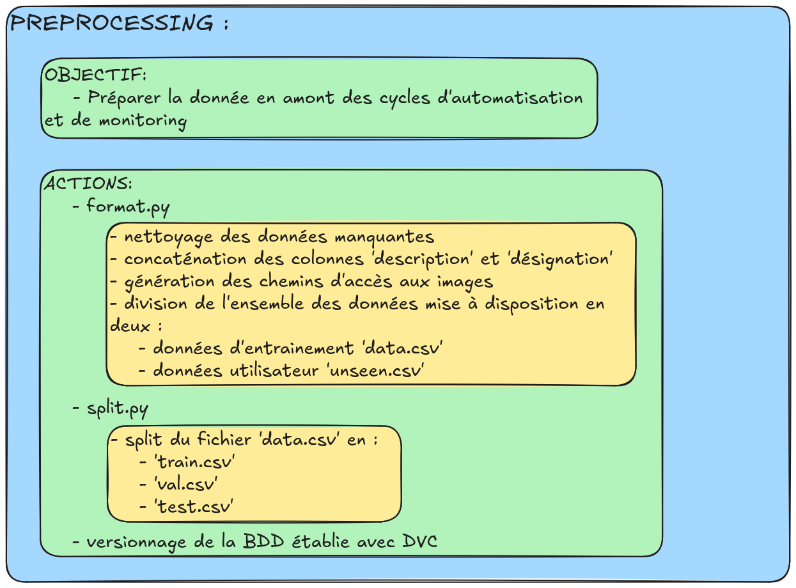
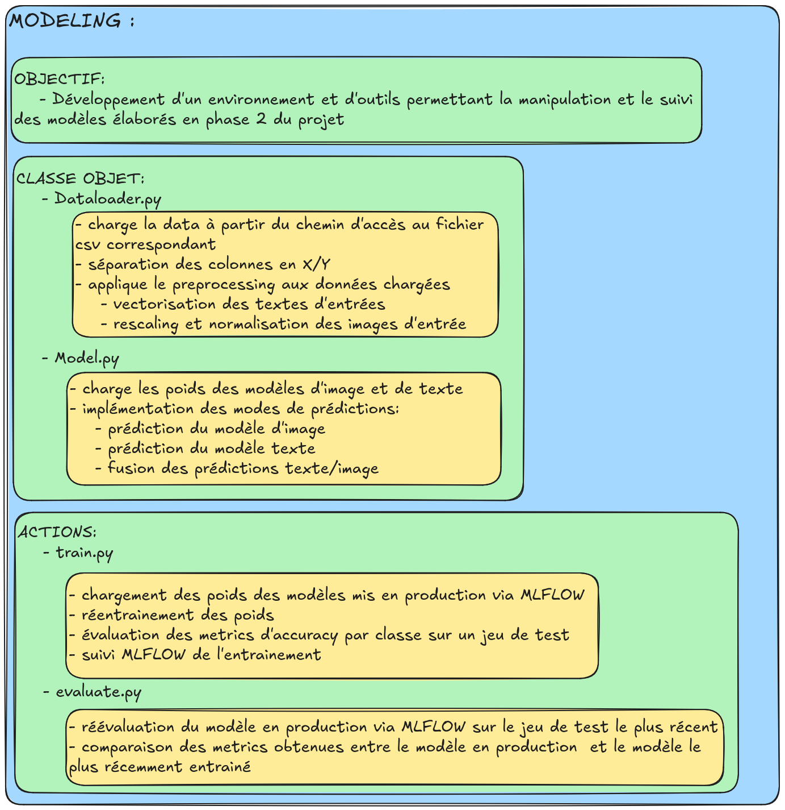
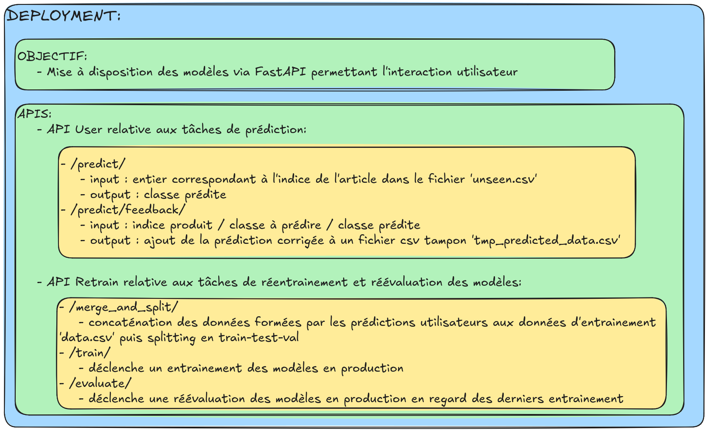
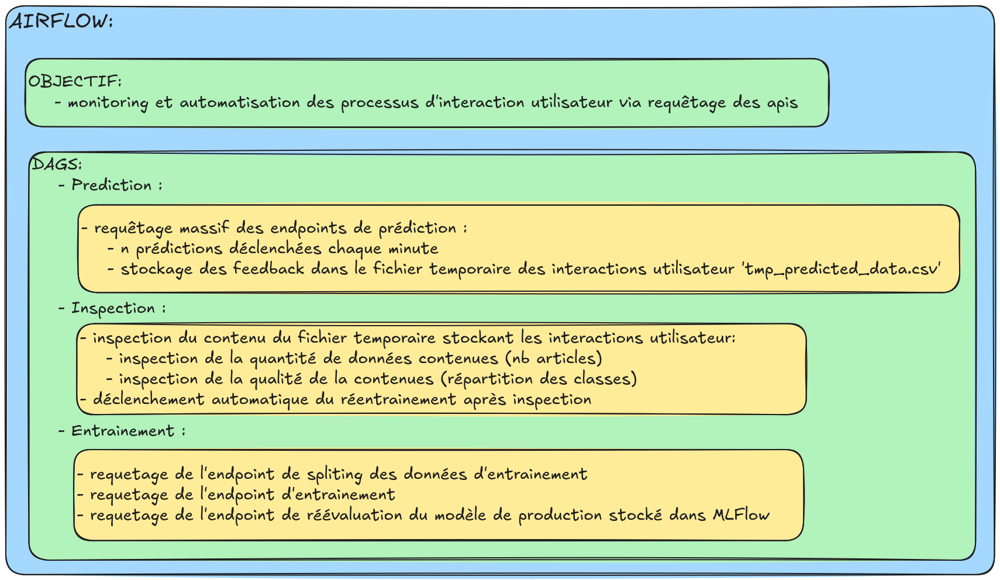

# Monitoring d'une Solution de Classification Multimodale

Ce projet implémente un système de classification multimodale (texte et image) pour des articles issus d'un catalogue e-commerce, avec un pipeline de monitoring et d'entraînement automatisé.


## Installation et Exécution
0. Créer un compte sur la plateforme [challengedata](https://challengedata.ens.fr/login/)
1. Télécharger le fichier images.zip en suivant le lien suivant: 
  ```bash
  https://challengedata.ens.fr/participants/challenges/35/download/supplementary-files
  ``` 
  puis le placer dans le dossier:
  ```bash
  /rakuten_mlops/data/raw/
  ```

2. Construire les conteneurs Docker :
   ```bash
   docker-compose up --build
   ```
## Port List

| Service    | URL                     | Credentials          |
|------------|-------------------------|----------------------|
| Airflow    | [0.0.0.0:5000](http://0.0.0.0:5000) | username: admin, mdp: admin |
| MLFlow     | [0.0.0.0:8000](http://0.0.0.0:8000) | -                    |
| User API   | [0.0.0.0:5001/docs](http://0.0.0.0:5001/docs) | -                    |
| Model API  | [0.0.0.0:8080/docs](http://0.0.0.0:8080/docs) | -                    |

## Workflow




## Structure du Projet

### 1. Airflow (Orchestration des tâches)
- `airflow/airflow.cfg` : Configuration d'Airflow.
- `airflow/airflow.db` : Base de données interne d'Airflow.
- `airflow/dags/` : Contient les DAGs pour le traitement des données et l'entraînement du modèle.
  - `inspect_tmp_user_data.py` : Inspection des données utilisateur temporaires.
  - `predictions_dag.py` : Pipeline de génération des prédictions.
  - `retrain_dag.py` : Pipeline d'entraînement des modèles.
- `airflow/logs/` : Logs des DAGs et de l'exécution d'Airflow.
- `airflow/webserver_config.py` : Configuration du serveur web d'Airflow.

### 2. Data (Jeux de données)
- `data/raw/` : Données brutes (images et fichiers CSV d'origine).
- `data/processed/` : Données prétraitées pour l'entraînement et l'évaluation du modèle.
  - `train.csv`, `val.csv`, `test.csv` : Jeux de données prétraités.
  - `unseen.csv` : Données non vues utilisées pour les prédictions utilisateurs automatisées.

### 3. Déploiement et Conteneurisation
- `docker-compose.yml` : Configuration des services Docker.
- `docker_services/` : Contient les configurations Docker pour différents services.
  - `deployment/`, `dev/`, `modeling/`, `preprocessing/` : Conteneurs pour le déploiement, le développement, la modélisation et le prétraitement.

### 4. Suivi des Expérimentations
- `mlflow.db` : Base de données MLflow pour le suivi des expériences.
- `mlruns/` : Dossiers des runs d'expérimentation MLflow.

### 5. Modèles et API
- `deploy_api.py` : API relative aux interactions utilisateur.
- `model_api.py` : API relative au monitoring des modèles.
- `models/catalog.json` : Fichier JSON contenant les relations entre code produit et label produit.

### 6. Notebooks
- `notebooks/` : Contient des notebooks d'exploration et de modélisation des données.
  - `data_exploration.ipynb` : Analyse exploratoire des données.
  - `modelisation.ipynb` : Expérimentation avec les modèles.

### 7. Code Source
- `src/modeling/` : Code lié à l'entraînement et l'évaluation des modèles.
  - `train.py` : Script d'entraînement du modèle.
  - `models.py` : Définition des architectures de modèles.
  - `dataloaders.py` : Définition des classes objets permettant de charger et prétraiter les données.
  - `evaluate.py` : Script de réévaluation du modèle mis en production et du dernier modèle entrainé.
- `src/preprocessing/` : Scripts de prétraitement des données.
  - `process.py` : Prétraitement des données textuelles et visuelles.

### 8. Tests
- `tests/` : Contient les tests unitaires et d'intégration.
  - `test_dataloader.py` : Tests sur le chargement des données.
  - `test_mlflow.py` : Tests liés au tracking MLflow.

### 9. Autres fichiers importants
- `params.yaml` : Fichier de configuration contenant les hyperparamètres et chemins des fichiers.
- `dvc.yaml` et `dvc.lock` : Suivi et gestion des fichiers de données avec DVC.

## Blocs d'automatisation 

### Preprocessing bloc :



### Modeling bloc :



### Deployment bloc :



### Airflow bloc :

